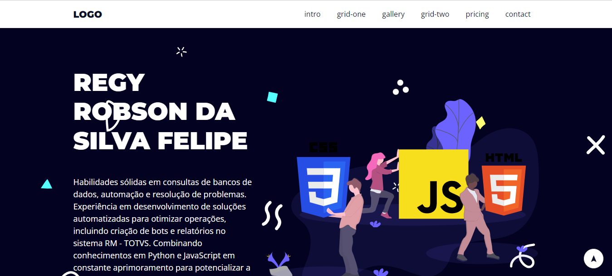

<h1 align="center" > Landing Page </h1>
<h2 align="center" > https://github.com/regyfelipe/LandingPage/</h2>

  <a href="#-tecnologias">Tecnologias</a>&nbsp;&nbsp;&nbsp;|&nbsp;&nbsp;&nbsp;
  <a href="#-projeto">Projeto</a>&nbsp;&nbsp;&nbsp;|&nbsp;&nbsp;&nbsp;
  <a href="#-layout">Layout</a>&nbsp;&nbsp;&nbsp;|&nbsp;&nbsp;&nbsp;
  

<!-- 

  

 -->

 

  

## 🚀 Tecnologias

Esse projeto foi desenvolvido com as seguintes tecnologias:

- HTML e CSS
- JavaScript
- Git e Github

## 💻 projeto

O Landing Page é um site personalizado.

- [Acesse o projeto finalizado, online](https://github.com/regyfelipe/LandingPage)

